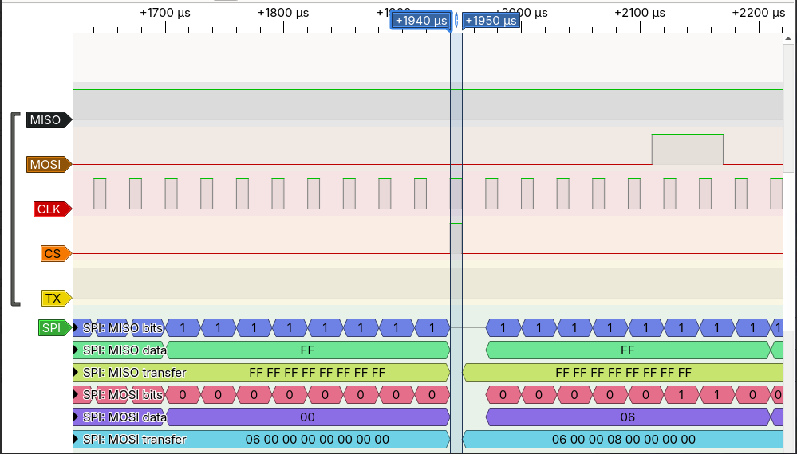
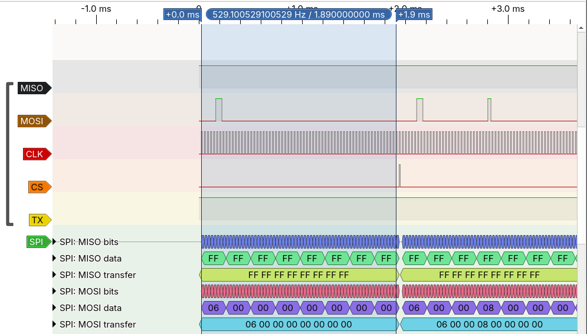
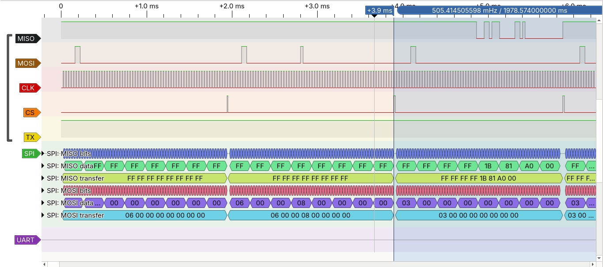
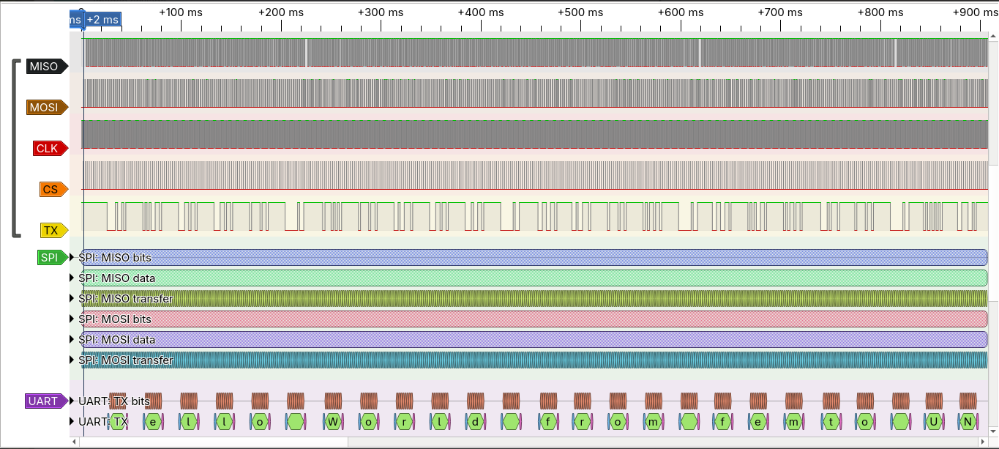

# hello_world_uart — Primer arranque del femto_UN: Hello World por UART

**Fecha:** 2026-10-05  **Estado:** Funciona en hardware (flash emulada en ESP32-C6, reloj de 100 kHz)

## Objetivo

Hacer que el chip **femto_UN** (`tt_um_femto`, femtoRV32 fabricado en Tiny Tapeout SKY 25b) arranque desde una memoria flash SPI y envíe `Hello World from femto UN` por la UART.

La memoria de programa es un **ESP32-C6 que emula la flash**, porque el módulo flash disponible resultó no ser confiable (ver [Problemas encontrados](#problemas-encontrados)).

```
┌──────────────┐  CS, CLK, MOSI  ┌──────────────────┐        ┌────────────┐
│  ESP32-C6    │ ◄────────────── │  Demo board TT   │  TXD   │  FTDI      │
│  flash SPI   │ ──────────────► │  femto_UN (ASIC) │ ─────► │  USB-UART  │ ──► minicom
│  emulada     │      MISO       │  + RP2350        │ ◄───── │            │
└──────────────┘                 └──────────────────┘  RXD   └────────────┘
```

Siguiente paso: repetir la prueba con una flash real de 3,3 V a 24 MHz y conectar la RAM SPI.

## Hardware y herramientas

- Demo board de Tiny Tapeout con el chip `tt_um_femto` (proyecto 238 del mux), controlada por MicroPython con el SDK `ttboard`
- ESP32-C6-WROOM-1 (StudioPixels), firmware en [`firmware/esp32_flash_emu`](../../firmware/esp32_flash_emu)
- Adaptador USB-UART FTDI FT232R a 3,3 V
- Analizador lógico (compatible Saleae, 24 MHz) con PulseView
- Programador CH341A y módulo W25QXX, usados en las primeras pruebas
- `mpremote`, `minicom`, `arduino-cli`, `flashrom`
- Firmware `uart_full_demo.S` de [`cicamargoba/femto_UN`](https://github.com/cicamargoba/femto_UN), compilado con `riscv-none-elf-gcc`

## Estructura

```
hello_world_uart/
├── README.md
├── femto_setup.py            # configura la demo board (va copiado dentro de ella)
├── sim/
│   └── sim_femto.py          # modelo ciclo a ciclo del chip, en Python
├── tools/
│   └── ch341a_spi_test.py    # lee una flash con el CH341A y la compara con un .bin
└── img/
```

## Conexiones

Los pines se toman de la **serigrafía de la demo board** y del `info.yaml` del proyecto.

| Señal | Demo board | ESP32-C6 | FTDI |
|-------|-----------|----------|------|
| `spi_cs_n` | `uo[2]` | GPIO7 | |
| `spi_clk` | `uo[5]` | GPIO6 | |
| `spi_mosi` | `uo[0]` | GPIO5 | |
| `spi_miso` | `ui[0]` | GPIO4 | |
| `TXD` del femto | `uo[7]` | | RXD |
| `RXD` del femto | `ui[2]` | | TXD |
| GND | GND | GND | GND |

- Los **8 DIP switches** de la demo board en **OFF**.
- No se unen los 3V3 entre placas; cada una se alimenta por su USB.
- Enchufar **primero la demo board** y luego el ESP32.

## Cómo funciona

Lo que sigue sale de leer el Verilog que se fabricó (commit `baab83f` de `cicamargoba/femto_UN`) y de las capturas del analizador.

### El bus SPI del chip

- El reloj SPI vale **`clk/3`** y **nunca se detiene**: sigue corriendo con `CS` en alto. Está en alto 1 ciclo de `clk` y en bajo 2.
- Cada lectura ocupa **65 períodos del reloj SPI** (195 ciclos de `clk`). En fase 0 la flash ve 65 flancos de subida con `CS` en bajo: 32 de comando (`03` + 24 bits de dirección) y 33 de datos. En fase 2 solo ve **64**: el que falta es el primer bit del comando.
- El femto muestrea `MISO` **un bit tarde**. Por eso el firmware se graba corrido un bit a la derecha (`fix_shift.py --bits 1 --dir right --fill 0`), y la memoria debe contener `firmware_shifted.bin`.

### Las tres fases de `CS`

Como el reloj no para, `CS` puede bajar en tres momentos distintos respecto a `CLK`, según qué instrucción se acaba de ejecutar:

| Fase | Cuándo ocurre | Qué ve la flash |
|------|---------------|-----------------|
| 0 | Fetch después de una instrucción normal | `CS` baja 1 ciclo antes del primer flanco: comando `03` correcto |
| 1 | Fetch después de un `lw`/`sw` a la UART | `CS` baja **a la vez** que sube `CLK`; funciona si la flash alcanza a ver ese flanco |
| 2 | Carga de datos desde la flash, el fetch siguiente, y las **dos primeras lecturas tras el reset** | El primer bit del comando nunca se envía: la flash recibe `06` y no contesta |

La fase 2 es el origen de los Bugs 2 y 6 del README del demo original.

En la captura se ve la fase 2: `CS` sube y baja **junto con un pulso de `CLK`** (de +1940 a +1950 µs, un ciclo de `clk`). Ese pulso cae con `CS` en alto, así que la memoria no lo cuenta.



Entre un pulso de `CS` y el siguiente quedan 64 flancos de subida (zona azul, 1,89 ms):



### El arranque depende de que `MISO` quede en alto

Tras el reset, las dos primeras lecturas salen en fase 2 y la flash las ignora. Lo que pasa después depende del nivel de `MISO` en reposo:

- **`MISO` en alto:** el femto lee `FFFFFFFF`. El decodificador toma el bit 3 como JAL, y esa instrucción salta 2 bytes hacia atrás. El femto vuelve a la dirección 0, ahora en fase 0, y arranca bien.
- **`MISO` en bajo:** lee `00000000`, que es `lb x0,0(x0)`: una carga desde la flash. Eso produce otra lectura en fase 2, otro cero, y el procesador queda en un bucle infinito pidiendo la dirección 0.

Por eso la memoria debe **ignorar los comandos que no sean `03`** y la línea `MISO` debe tener **pull-up**.

La captura del arranque lo muestra completo. Las dos primeras lecturas llegan como `06 00 00 00` y `06 00 00 08` (son `03 00 00 00` y `03 00 00 04` con el primer bit perdido) y la memoria no contesta: `MISO` queda en `FF`. La tercera ya es `03 00 00 00`, otra vez desde la dirección 0, y la memoria entrega `1B 81 A0 00`, el inicio de `firmware_shifted.bin`.



> `06` es el código de *Write Enable* en una flash, pero aquí nadie está escribiendo: es el comando de lectura visto con un bit de corrimiento.

### La UART

El divisor está fijo en el chip: `27000000/115200/16 = 14`, y el contador recarga en 12, así que cada bit dura `16 × 13 = 208` ciclos de reloj.

**baud = clk / 208.** Con `clk` = 100 kHz son **481 baud**. Los 224 ciclos que cita el README original no coinciden con el RTL.

## Procedimiento

### 1. Compilar el firmware

```bash
export PATH=~/riscv-toolchain/bin:$PATH
cd femtoRV/firmware/asm        # OBJECTS = uart_full_demo.o en el Makefile
make -B CROSS=riscv-none-elf
```

Debe terminar con `Primeros 8 bytes corregido: 1b 81 a0 00 09 81 c1 80` y generar `firmware_shifted.bin` (1120 bytes).

### 2. Cargar el emulador en el ESP32-C6

```bash
cd firmware/esp32_flash_emu
xxd -i <ruta>/firmware_shifted.bin > firmware.h
arduino-cli compile --fqbn esp32:esp32:esp32c6 .
arduino-cli upload -p /dev/ttyACM1 --fqbn esp32:esp32:esp32c6 .
```

### 3. Copiar la configuración a la demo board

```bash
mpremote cp femto_setup.py :femto_setup.py
```

### 4. Correr la prueba

Terminal 1:
```bash
sudo modprobe ftdi_sio
sudo minicom -b 481 -D /dev/ttyUSB0
```

Terminal 2:
```bash
mpremote connect /dev/ttyACM0
```
```python
FREQ=100000; exec(open('femto_setup.py').read())
tt.reset_project(False)
```

Para repetir: `tt.reset_project(True)` y luego `tt.reset_project(False)`.

> En el REPL las líneas se escriben a mano o sin espacios al inicio. Pegar bloques con Ctrl+E desde `mpremote` dio `SyntaxError`; por eso la configuración vive en un archivo.

### 5. Ver las señales en el analizador

| Qué mirar | Frecuencia | Muestras | Decodificador |
|-----------|-----------|----------|---------------|
| Todo junto | 1 MHz | 2 M (2 s) | SPI modo 0 + UART 481 8N1 |
| Solo UART | 20 kHz | 200 k (10 s) | UART 481 8N1 |

Trigger en el flanco de bajada de `CS`. Orden: `tt.reset_project(True)` → **Run** → `tt.reset_project(False)`.

## Resultado esperado

En minicom, cerca de un segundo después de soltar el reset:

```
Hello World from femto UN
```

En el analizador, con el decodificador UART a 481 baud, se lee el mensaje completo en cerca de un segundo, mientras el bus SPI no deja de leer instrucciones:



Después del mensaje el firmware enciende el LED de `uo[6]` y espera. El retardo está calibrado para 24 MHz, así que a 100 kHz cada parpadeo dura unos dos minutos.

## Problemas encontrados

| Síntoma | Causa | Solución |
|---------|-------|----------|
| `MISO` siempre en 0 con la flash real; el femto repite `06 00 00 00` | `MISO` en bajo en reposo: bucle de cargas descrito arriba | `MISO` en alto en reposo (comprobado con el emulador; pendiente con flash real) |
| `ui[0]` forzado en 0 aunque se corría `init(Pin.IN)` | En `ttboard`, `init(Pin.IN)` no liberó el pin; el RP2350 lo seguía manejando como salida | `tt.pins.ui_in0.mode = Pin.IN` (ya incluido en `femto_setup.py`) |
| Entradas `ui[1..7]` leyendo en alto, aviso de *contention* | DIP switches en ON | Todos en OFF |
| `AttributeError: What is 'tt_um_femto'?` y `No carrier present` | No se confirmó; ocurrió con los DIP en ON y cables puestos en `uo`/`ui` | Se resolvió arrancando con los DIP en OFF y esos pines libres |
| Con la punta del analizador en `MISO`, el pull-up interno ya no alcanza | La punta carga la línea hacia abajo | Medir sin esa punta, o usar el ESP32, que maneja `MISO` con fuerza |
| Módulo flash W25QXX no confiable | `flashrom` lo identifica como `W25Q64.W` (ID `EF 60 17`, familia de 1,8 V) y se midió `DO` en corto con GND | Se reemplazó por el ESP32-C6 |
| La UART envía 27 bytes `00` en vez del texto | El emulador contestaba también los comandos `06`; el femto no reiniciaba, `lui t1,0x400` no se ejecutaba y el dato nunca llegaba a la UART | El emulador solo responde a `03` |
| Minicom no muestra nada a 481, y `�` a 446 | Los bytes eran `00` (invisibles); a 446 se leían mal | Medir el ancho de bit con el analizador: 9 bits en ~18,7 ms = 481 baud |
| La demo board aparece como `RP2350 Boot` y sin puerto serie | El ESP32 se enchufó antes que la demo board | Enchufar primero la demo board |
| No existe `/dev/ttyUSB0` con el FTDI conectado | Falta el driver | `sudo modprobe ftdi_sio` |
| El ESP32 se reinicia con `Interrupt wdt timeout` | Se desactivaban las interrupciones con `CS` atascado en bajo | Se quitó `noInterrupts()` del emulador |

## Simulación

`sim/sim_femto.py` es un modelo en Python, ciclo a ciclo, del controlador de flash, el CPU y la UART del chip, que ejecuta el firmware real. No es una simulación del Verilog, pero reproduce lo medido.

```bash
python3 sim/sim_femto.py <ruta>/firmware.bin      # el .bin sin corrimiento
```

| Comportamiento de la flash | Lo que sale por la UART |
|----------------------------|-------------------------|
| Contesta también los comandos `06` | 27 bytes `00`, uno cada 3564 ciclos |
| Solo contesta `03` y ve el flanco de la fase 1 | `Hello World from femto UN\n\r` |
| Solo contesta `03` y **no** ve el flanco de la fase 1 | `HHHH…` sin parar |

El primer caso coincide con la captura: 3564 ciclos a 100 kHz son 35,6 ms y se midieron ~35,5 ms entre bytes. El tercero es una predicción del modelo que no se ha visto en hardware; indica qué buscar si una flash real falla.

## Limitaciones y pendientes

- El ESP32 atiende el SPI por software, así que la prueba corre a **100 kHz**, no en el rango de 22,5 a 25 MHz del demo original.
- Falta repetirla con una **flash real de 3,3 V** (W25Q32JV) y pull-up en `MISO`. A esa velocidad el margen de la fase 1 es de pocos nanosegundos.
- Las cargas de datos desde la flash (`lb`/`lw` a direcciones de programa) no funcionan en este chip; el firmware las evita usando inmediatos.
- Falta probar el eco de la UART a 24 MHz y la RAM SPI.

## Referencias

- RTL y firmware: [`cicamargoba/femto_UN`](https://github.com/cicamargoba/femto_UN) (`src/MappedSPIFlash.v`, `src/femtorv32_quark.v`, `src/uart.v`)
- Emulador de flash en FPGA, prueba anterior: [`fpga/spi_flash_emu`](../../fpga/spi_flash_emu)
