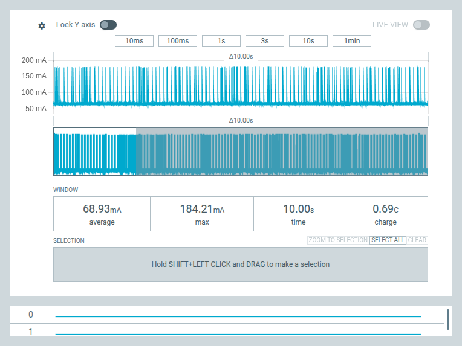
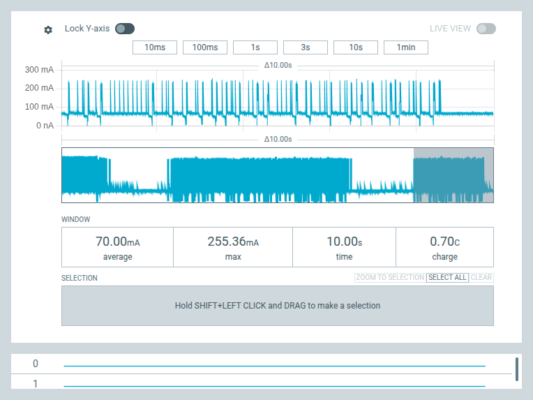

# Capacidad de corriente del 3V3 de la Demo Board — Nordic PPK2

**Fecha:** TODO  **Estado:**  Medido

## Objetivo

Verificar si la alimentación de 3V3 de la Tiny Tapeout Demo Board v3.2 puede soportar los picos de corriente de una carga externa, antes de diseñar la placa tester. Como carga de prueba se conectó un módulo Wi-Fi de bajo consumo al pin 3V3 de un header de la demoboard, midiendo con el PPK2.

Se registraron dos casos:
- **Código femto_UN:** TODO (qué estaba corriendo)
- **Firmware de fábrica:** TODO (qué estaba corriendo)

## Hardware y herramientas

- Tiny Tapeout Demo Board v3.2 con el chip femto_UN
- Módulo Wi-Fi de bajo consumo como carga
- Nordic Power Profiler Kit II (PPK2)
- nRF Connect for Desktop → Power Profiler

## Resultados

Ventana de medición de **10 s** en ambos casos.

| Caso | Promedio | Pico | Carga en 10 s |
|------|----------|------|---------------|
| Código femto_UN | 68,93 mA | 184,21 mA | 0,69 C |
| Firmware de fábrica | 70,00 mA | 255,36 mA | 0,70 C |

### Código femto_UN

Consumo base de ~60 mA con picos periódicos de hasta ~184 mA.

### Firmware de fábrica

Consumo base similar, con picos más altos (hasta ~255 mA) y tramos de distinta actividad a lo largo de la ventana.

## Análisis de la alimentación de la demoboard

El 3V3 de la demoboard lo genera **U1, un TLV1117LV33** (LDO lineal, SOT-223) a partir de VBUS (5 V del USB). Antes del LDO, VBUS pasa por el fusible **F1 de 350 mA** y el ferrite FB1.

### LDO TLV1117LV33

| Parámetro | Valor (hoja de datos) |
|-----------|-----------------------|
| Corriente de salida recomendada | 0 a 1 A |
| Límite de corriente (mínimo) | 1,1 A |
| Dropout a 3,3 V | 90 mV @ 200 mA, 230 mV @ 500 mA |
| Tensión de entrada | 2 a 5,5 V (máx. absoluto 6 V) |
| RθJA (SOT-223) | 62,9 °C/W |

Estimación térmica con 5 V de entrada, P = (VIN − VOUT) × I = 1,7 V × I:

| Corriente | Potencia | Tj estimada (25 °C ambiente) |
|-----------|----------|------------------------------|
| 255 mA | 0,43 W | ~52 °C  |
| 500 mA | 0,85 W | ~78 °C  |
| 1 A | 1,7 W | ~132 °C  (máx. recomendado 125 °C) |

## Conclusiones

- La carga generó picos de hasta **255 mA** (promedio ~70 mA).
- El LDO **no es el limitante**: soporta 1 A recomendado, tiene límite mínimo de 1,1 A y térmicamente aguanta ~500 mA continuos con Tj < 80 °C.
- El limitante es el fusible **F1 de 350 mA** en VBUS: toda la corriente de 3V3 pasa por él. El presupuesto para cargas externas es **350 mA menos el consumo propio de la demoboard** (RP2350, femto_UN, LEDs, display).
- Los picos cortos probablemente no disparan el fusible reseteable, pero una carga sostenida cerca de ese valor sí.

## Pendiente

- Medir el consumo propio de la demoboard con el PPK2 en modo Ampere Meter en serie con VBUS, sin carga externa, para conocer el margen real.
- Confirmar la corriente de *hold* y *trip* de F1 en el BOM de la demoboard.

## Referencias

- [Esquemático de la Tiny Tapeout Demo Board v3](https://github.com/TinyTapeout/tt-demo-pcb)
- Hoja de datos TLV1117LV, Texas Instruments (SBVS160C)