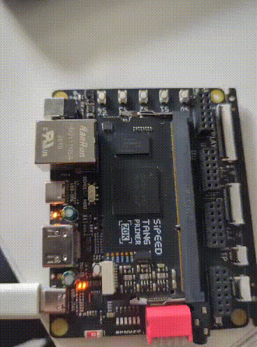

# led_blink — Ejemplo mínimo del flujo Gowin en Tang Primer 20K

**Fecha:** 2026-09-07  **Estado:** ✅ Funciona



## Objetivo

Hacer parpadear un LED a ~1 Hz para validar el flujo completo de desarrollo en la **Sipeed Tang Primer 20K Dock** usando herramientas por línea de comandos, sin abrir el IDE de Gowin:

```
Verilog ──► Yosys (síntesis) ──► Gowin gw_sh (place & route) ──► openFPGALoader ──► FPGA
 .v           netlist_gw.v          led.fs (bitstream)
```

Es la plantilla base para las demás pruebas en FPGA de este repo.

## Hardware y herramientas

- Sipeed Tang Primer 20K Dock (FPGA **GW2A-LV18PG256C8/I7**, device version C)
- Yosys (`synth_gowin`), Gowin EDA V1.9.11.03 Education (`gw_sh`), openFPGALoader
- Instalación del entorno: ver [`docs/toolchain.md`](../../docs/toolchain.md)

## Estructura

```
led_blink/
├── Makefile              # orquesta todo el flujo
├── synth.ys              # script de síntesis de Yosys
├── pnr.tcl               # script de place & route de Gowin
├── src/led_blink.v       # diseño en Verilog
├── constraints/led.cst   # asignación de pines
└── img/                  # evidencia de la prueba
```

## Pines

| Señal | Pin | Descripción |
|-------|-----|-------------|
| `Clock` | H11 | Oscilador de 27 MHz de la placa |
| `IO_voltage` | L14 | LED |

## Cómo funciona el diseño

Un contador de 24 bits cuenta ciclos del reloj de 27 MHz. Al llegar a `13_499_999` (≈ 0,5 s) se reinicia y genera un pulso de un ciclo (`count_value_flag`) que invierte el estado del LED. Así el LED cambia cada 0,5 s y parpadea a ~1 Hz.

## Cómo reproducir

```bash
cd fpga/led_blink
make            # síntesis + place & route
make program    # programa la FPGA (en SRAM, se pierde al apagar)
make clean      # borra build/
```

Si Gowin está instalado en otra ruta:

```bash
make GW_SH=/ruta/a/tu/IDE/bin/gw_sh
```

Pasos individuales:

| Target | Qué hace | Salida |
|--------|----------|--------|
| `make synth` | Yosys sintetiza el Verilog para GW2A | `build/netlist_gw.v` |
| `make pnr` | Gowin hace place & route con el `.cst` | `build/led/impl/pnr/led.fs` |
| `make program` | openFPGALoader carga el bitstream | — |

Para verificar que la placa está conectada:

```bash
openFPGALoader --scan-usb
```

## Resultados

El LED en L14 parpadea a ~1 Hz tras `make program`.

## Problemas y soluciones

- **`gw_sh` intenta abrir una ventana o falla sin display:** el Makefile exporta `QT_QPA_PLATFORM := offscreen` para que Gowin corra en modo headless.
- **`create_project` cambia el directorio de trabajo:** por eso `pnr.tcl` guarda `[pwd]` en `root_dir` antes de llamarlo y usa rutas absolutas en `add_file`.
- **El bitstream no queda en `build/`:** Gowin lo genera anidado en `build/led/impl/pnr/led.fs`.
- **Gowin no arranca en Fedora 44:** conflicto con `libfreetype.so.6` y `libstdc++.so.6` incluidas en Gowin. Ver [`docs/toolchain.md`](../../docs/toolchain.md#2-gowin-eda).

## Usar como plantilla

Para un proyecto nuevo, copiar esta carpeta y cambiar:

1. `TOP`, `SRC`, `CST` y `BITSTREAM` en el `Makefile`
2. `read_verilog` y `-top` en `synth.ys`
3. `-name`, el `.cst`, `-top_module` y `-output_base_name` en `pnr.tcl`
