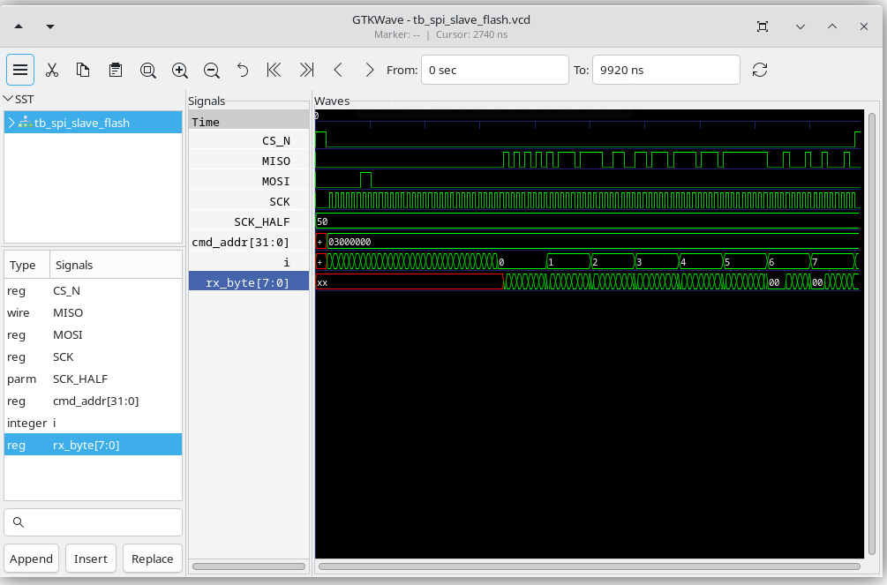
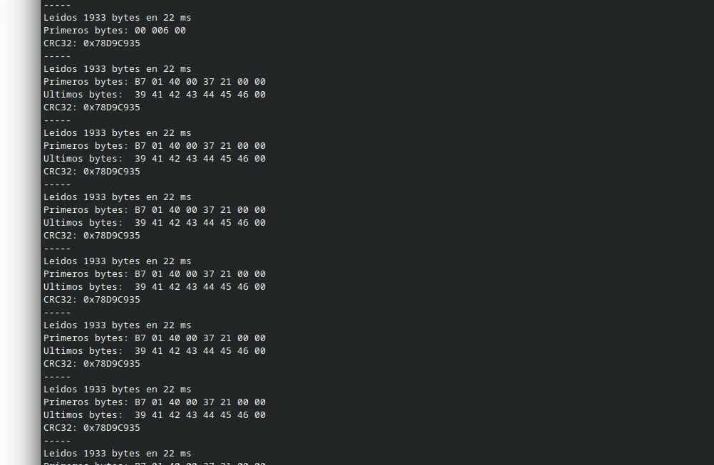
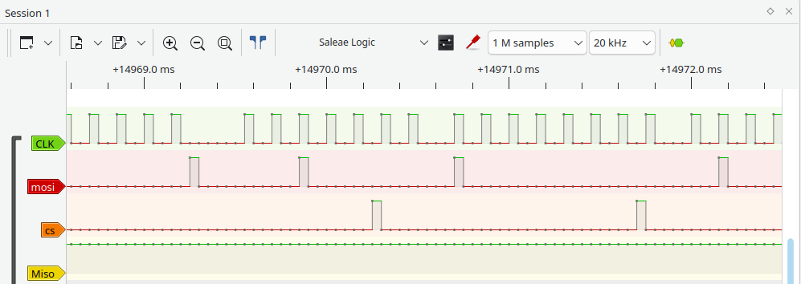
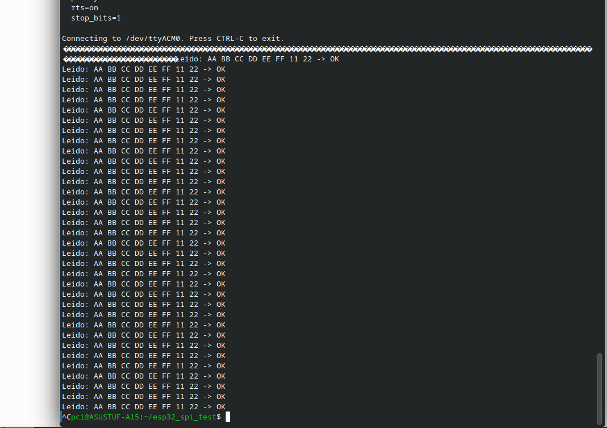

# spi_flash_emu — Emulador de flash SPI en Tang Primer 20K

**Fecha:** 2026-09-21  **Estado:**  Funciona (simulación y hardware)

## Objetivo

Emular una memoria flash SPI NOR dentro de la FPGA para que sirva como **memoria de programa del procesador femto_UN**, sin necesidad de un chip de flash físico.

Antes de conectarla al ASIC, se valida con un **ESP32-C6 como maestro SPI**, que lee el contenido completo y verifica su integridad con un CRC32.

```
┌─────────────┐        SPI modo 0         ┌──────────────────────────┐
│  ESP32-C6   │  CS_N, SCK, MOSI ───────► │  Tang Primer 20K         │
│  (maestro)  │ ◄─────────────── MISO     │  spi_slave_flash + BRAM  │
└─────────────┘                           │  8 KB precargados        │
                                          └──────────────────────────┘
```

Siguiente paso: reemplazar el ESP32 por el femto_UN como maestro.

## Hardware y herramientas

- Sipeed Tang Primer 20K Dock (GW2A-LV18PG256C8/I7)
- ESP32-C6-WROOM-1 (StudioPixels), firmware en [`firmware/esp32_spi_test`](../../firmware/esp32_spi_test)
- Yosys + Gowin EDA + openFPGALoader (flujo igual a [`led_blink`](../led_blink))
- Icarus Verilog + GTKWave para simulación
- Analizador lógico para verificar las señales en hardware

## Estructura

```
spi_flash_emu/
├── Makefile
├── synth.ys
├── pnr.tcl
├── rtl/
│   ├── top.v                 # top: LEDs + instancia del emulador
│   ├── spi_slave_flash.v     # esclavo SPI con comando READ y BRAM
│   └── mem_init.hex          # contenido precargado (1120 bytes)
├── sim/
│   ├── tb_spi_slave_flash.v  # testbench con verificación automática
│   ├── mem_init.hex          # enlace simbólico a ../rtl/mem_init.hex
│   └── SPI_Flash.gtkw        # vista guardada de GTKWave
├── constraints/
│   └── tang_primer_20k.cst
└── img/
```

## Conexiones

Se usa la fila inferior del **PMOD0** de la Dock (el que está bajo la serigrafía "MIC ARRAY"):

| Señal | Pin FPGA | Pin ESP32-C6 | Notas |
|-------|----------|--------------|-------|
| `CS_N` | T6 | GPIO7 | Pull-up interno en la FPGA |
| `SCK` | T7 | GPIO6 | Pull-down interno |
| `MOSI` | T8 | GPIO5 | Pull-down interno |
| `MISO` | P9 | GPIO4 | |
| GND | GND | GND | Tierra común obligatoria |

LEDs de diagnóstico:

| LED | Pin | Función |
|-----|-----|---------|
| `led_heartbeat` | L14 | Parpadea siempre (~0,8 Hz): confirma que el bitstream está corriendo |
| `led_cs` | N14 | Se enciende mientras hay una transacción SPI activa |

> Los pines del PMOD se tomaron de la **serigrafía de la placa**, no del esquemático; la primera suposición a partir del esquemático era incorrecta.

## Cómo funciona

`spi_slave_flash.v` implementa el comando **READ (0x03)** de una flash SPI NOR en **modo 0** (CPOL=0, CPHA=0):

1. Con `CS_N` en bajo, recibe 8 bits de comando y 24 bits de dirección por `MOSI`, muestreados en el **flanco de subida** de `SCK`.
2. Si el comando es `0x03`, empieza a enviar datos por `MISO`, actualizándolo en el **flanco de bajada** de `SCK`, desde la dirección recibida.
3. **Lectura continua:** mientras `CS_N` siga en bajo, al terminar cada byte pasa automáticamente al siguiente.
4. Al subir `CS_N`, todo se reinicia.

La lógica corre directamente con el reloj `SCK` del maestro, sin usar el reloj de 27 MHz de la placa.

### Memoria

- **8 KB** en BRAM (`MEM_BYTES = 8192`, `ADDR_WIDTH = 13`). Solo se usan los 13 bits bajos de la dirección, así que las direcciones mayores a 8 KB dan la vuelta.
- Se precarga en síntesis con `$readmemh` desde `rtl/mem_init.hex`.
- Contenido actual: `firmware_shifted.bin` del femtoRV, **1120 bytes**. TODO: explicar qué significa "shifted".

Para cargar otro programa:

```bash
xxd -p -c1 programa.bin > rtl/mem_init.hex
make clean && make
```

### Limitaciones

- Solo soporta **READ (0x03)**. Otros comandos (Fast Read, JEDEC ID, Status, escritura) no están implementados: `MISO` queda en 0.
- El contenido es fijo: para cambiarlo hay que volver a sintetizar.

## Cómo reproducir

### Simulación

```bash
cd fpga/spi_flash_emu
make sim     # corre el testbench
make wave    # abre GTKWave con las formas de onda
```

El testbench envía `0x03 + 0x000000`, lee 1120 bytes y los compara uno a uno con `mem_init.hex`. Salida esperada:

```
RESULTADO: 1120/1120 bytes correctos -> OK
```

### Hardware

```bash
make            # síntesis + place & route
make program    # programa la FPGA (SRAM)
```

Luego se carga [`firmware/esp32_spi_test`](../../firmware/esp32_spi_test) en el ESP32-C6 y se abre el monitor serial a 115200 baudios.

## Resultados

### Simulación



Los 1120 bytes leídos coinciden con el archivo de referencia.

### Hardware







El ESP32-C6 lee los 1120 bytes a 1 MHz y calcula su CRC32.

| | CRC32 |
|---|---|
| Esperado